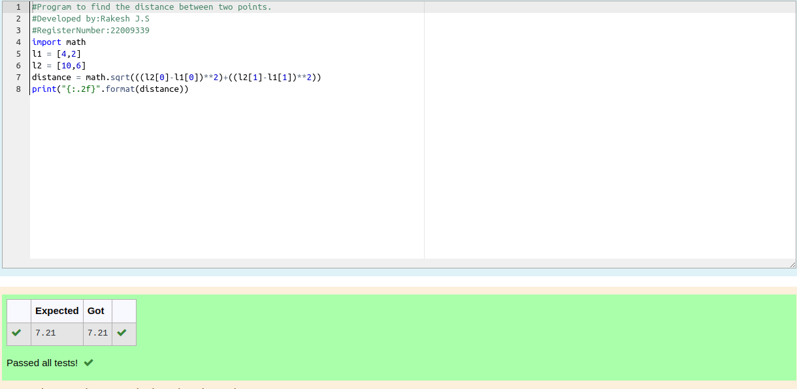

# DISTANCE-BETWEEN-TWO-POINTS

## AIM:
To write a python program to find the distance two 2 points
## ALGORITHM:
### Step 1: 
### Step 2: 
### Step 3: 
Substitute the values in the distance formula 

 
### Step 4: 
### Step 5: 
### PROGRAM:
````python
#Program to find the distance between two points.
#Developed by:Rakesh J.S 
#RegisterNumber:22009339
import math
l1 = [4,2]
l2 = [10,6]
distance = math.sqrt(((l2[0]-l1[0])**2)+((l2[1]-l1[1])**2))
print("{:.2f}".format(distance))
````
  


### OUTPUT:


### RESULT:
